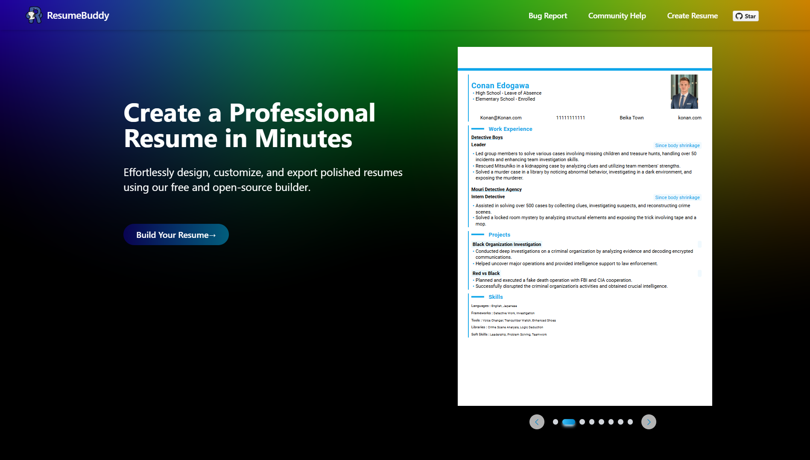
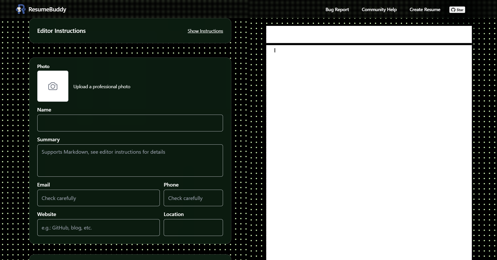

<div align="center">
  
</div>

# ResumeBuddy

<div align="center">
  
</div>

<div align="center">

## 🔗

#### [Have VPN but still have issues? Submit an Issue to help us improve](https://github.com/arunava-12/ResumeBuddy/issues)

#### [Don't know how to write a good resume? Check out these resume tips](RESUME_TIPS.md)

<p align="center">
  <a href="https://github.com/arunava-12/ResumeBuddy/stargazers">
    
  </a>
  <a href="https://github.com/arunava-12/ResumeBuddy/network/members">
    
  </a>
  <a href="https://github.com/arunava-12/ResumeBuddy/issues">
    
  </a>
  <a href="https://github.com/arunava-12/ResumeBuddy/blob/main/LICENSE">
    
  </a>
</p>

<div align="center">
  
</div>

</div>

---

## 📋 English

### 🚀 Project Introduction

ResumeBuddy is a free open-source online resume builder that helps job seekers quickly create professional, beautiful resumes. It supports multiple templates, real-time editing, PDF export, and ensures your privacy data security.

### ✨ Key Features

- 🎨 Multiple beautiful resume templates
- 📱 Responsive design for both mobile and desktop
- 🔒 Privacy-focused with all data stored locally
- 📤 One-click PDF export
- 🖥️ Real-time preview of edits
- ✏️ Markdown format support for easier content editing

### 📝 Markdown Format Support

<div align="center">
  
</div>

This project supports Markdown format to make resume content editing easier:

- **Unordered lists**: Type `- ` or `* ` to create unordered lists (note the space after)
- **Ordered lists**: Type `1. ` to create ordered lists (note the space after)
- **Bold text**: Type `**text**` or `__text__` to create bold text

### 🤝 Contribute

We welcome community contributors to participate in project development, especially adding new resume templates. Check out the [Template Contribution Guide](TEMPLATE_CONTRIBUTION.md) to learn how to create and submit your templates.

### 🔗 Online Usage

Visit [https://ResumeBuddy.ltlyl.fun/](https://ResumeBuddy.ltlyl.fun/) to get started

Alternative link: [https://resume-to-job.vercel.app/](https://resume-to-job.vercel.app/)

### 💻 Local Development

```bash
# Clone the repository
git clone https://github.com/arunava-12/ResumeBuddy.git

# Navigate to project directory
cd ResumeBuddy

# Install dependencies
npm install

# Start development server
npm run dev
```

After starting, visit http://localhost:3000 to view the website

### 🛠️ Tech Stack

- Next.js
- React
- TypeScript
- Tailwind CSS
- Redux Toolkit
- React PDF

### 📄 License

This project is licensed under the [AGPL-3.0 license](LICENSE).

### 🙏 Acknowledgements

Special thanks to the creators and contributors of [open-resume](https://github.com/xitanggg/open-resume). This derivative project is based on their outstanding work.
